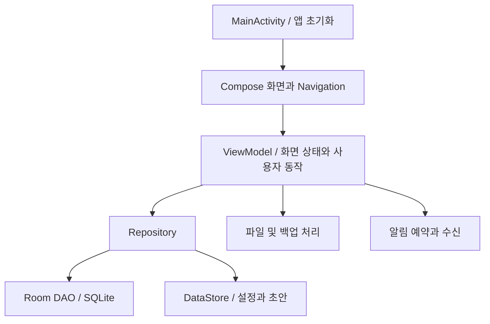

# 구조 안내

## 전체 흐름

위 그림은 소스를 읽기 위한 요약입니다. 모든 관심사가 완전히 분리되어 있다는 뜻은 아닙니다. 파일·일정 처리와 ViewModel의 결합은 후속 리팩터링 검토 대상입니다.

## 화면 계층

`ui/screen`에는 홈, 지원 목록·상세·등록, 커리어 목록·상세·작성, 리포트, 설정 화면이 있습니다. `ui/navigation`은 라우트와 화면 인자를 연결합니다. `ui/component`는 재사용 카드를 담당합니다.

공통 컨테이너의 광고 위치와 하단 내비게이션은 운영 제품의 요구사항입니다. 공개용 사본은 실제 광고 코드를 포함하지 않으며 동일한 컴포넌트 호출 지점에 설명용 자리표시자를 제공합니다.

## 화면 상태

ViewModel은 Repository의 Flow를 구독하고 Compose가 읽을 StateFlow를 구성합니다. 지원 검색·필터·정렬은 원본 목록과 선택 상태를 결합합니다. 상태의 초기값을 실제 빈 데이터로 오인하지 않도록 로딩과 빈 결과를 구분하는 것이 중요합니다.

비동기 저장에서는 함수 호출과 저장 완료가 다릅니다. 사용자가 완료 화면을 보는 시점은 DB 저장 결과와 일치해야 합니다. 오류 시 입력을 보존하고 재시도할 수 있어야 합니다.

## 영속 데이터

Room 모델에는 지원, 상태 이력, 면접과 질문, 커리어 기록이 있습니다. 부모·자식 관계의 외래키와 삭제 정책은 업데이트 방식에도 영향을 줍니다. 부모 행을 교체하는 저장과 특정 필드를 UPDATE하는 저장은 의미가 다릅니다.

공개 사본에는 DB 스키마 자료와 마이그레이션 코드가 포함됩니다. 스키마 파일의 존재만으로 과거 사용자 데이터가 안전하게 이전된다고 증명되지는 않습니다. 버전별 샘플 DB를 이용한 테스트가 필요합니다.

## 서류 스냅샷

원본 문서는 이후 수정될 수 있으므로 제출 당시 텍스트를 별도 JSON으로 보관하는 구조가 도입됐습니다. 텍스트의 독립 보존과 첨부파일의 독립 보존은 별개의 문제입니다. 파일 경로만 복사하면 원본 파일이 사라졌을 때 제출본도 열 수 없을 수 있습니다.

스냅샷의 포맷 버전, 제출 시점, 이전 텍스트 형식과의 호환성, 관련 파일의 수명주기는 함께 관리해야 합니다.

## 초안과 설정

DataStore는 언어·테마와 초안 저장에 사용됩니다. 문서별 키 구분뿐 아니라 원자적인 갱신, 초기 로딩 완료, 최종 저장과 자동 저장의 순서가 중요합니다. 초안 맵 전체를 여러 화면이 동시에 갱신할 때에는 오래된 상태가 다른 문서를 덮어쓰지 않는지 확인해야 합니다.

## 백업과 외부 파일

백업·복원은 DB와 파일을 함께 다루므로 여러 단계의 실패가 가능합니다. 검증, 안전한 원본 사본, 교체, 최종 열기, 실패 복구를 구분해야 합니다. ZIP의 항목 경로를 실제 추출 경로와 비교하고, 파일 개수·크기 제한도 고려해야 합니다.

## 알림

알림은 예약 함수만으로 끝나지 않습니다. 권한, 일정 변경, 삭제, 재부팅, 시간대 변경, 수신 시 유효성 확인, 올바른 화면 이동이 하나의 기능입니다. 일정 식별자와 지원 기록 식별자를 혼동하지 않는 것이 중요합니다.

## AI 확장

`AiRepository`의 제공자 경계는 외부 서비스 연결을 위한 확장 지점입니다. 인터페이스가 존재하는 것과 실제 AI 서비스가 제공되는 것은 다릅니다. 외부 전송 동의, 실패 안내, 원본 보존, 키의 서버 측 관리가 필요합니다.
